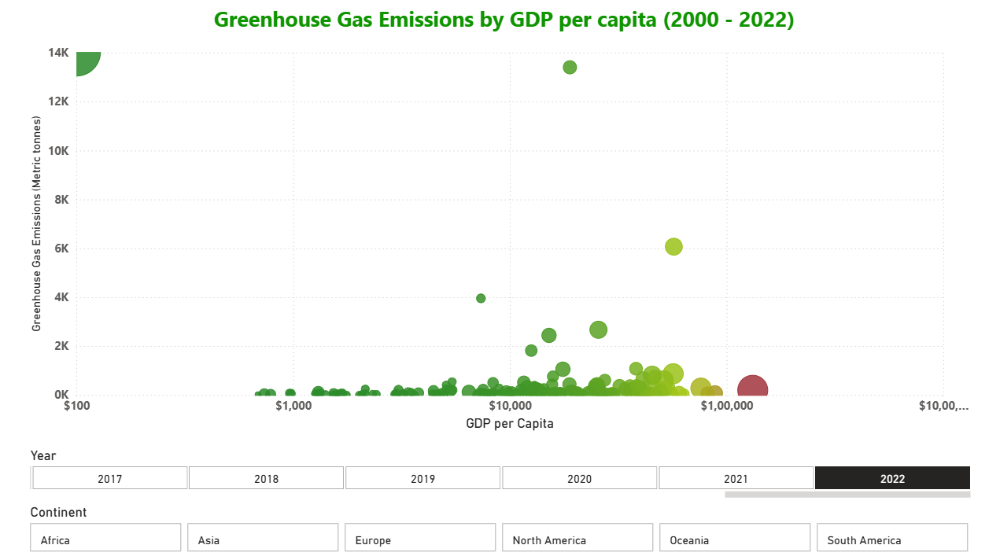
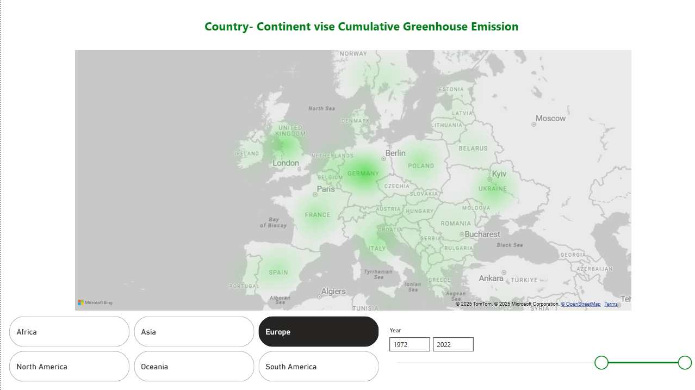

# 🌍 Greenhouse Gas Emissions Analysis Dashboard

This Power BI project explores **global greenhouse gas (GHG) emissions** and their relationship with **population, GDP, and per capita emissions** across countries and continents.  
The report provides a **comprehensive overview of emission trends (1850–2022)** and allows interactive exploration of key insights through slicers and visuals.
In addition to the report, there is the python script for webscraping countries and continent for the purpose since the raw data did not have the continent column.

---

## 📊 Dashboard Overview

### 1. **Key KPIs**
- **Total Greenhouse Gas Emissions (Million Metric Tonnes)**  
- **Per Capita Emissions (Metric Tonnes per person)**  
- **Highest Per Capita Emitter Country (dynamic by year)**  
- **Lowest Per Capita Emitter Country (dynamic by year)**  

### 2. **Visuals**
- **Line Chart**: Total emissions trend over time, with projections.  
- **Donut Chart**: Contribution of Top 5 countries vs. the rest.  
- **Table**: Top 5 emitters with population, per capita emissions, and GDP per capita.  
- **Bar Chart**: Emissions by continent.  
- **Scatter Plot**: Relationship between GDP per capita and GHG emissions, with bubble color showing per capita emissions.  

---

## 🔍 Key Insights
- Emissions have grown steadily since the 1980s, with sharp increases in Asia.  
- **Asia** dominates global emissions driven by rapid industrialization in India and China. 
- Countries like **Qatar** consistently appear as top per capita emitters particularly due to extraction of crude oil, while smaller island nations like Marshall Islands often have the lowest.  
- Countries such as China, US, India, Russia and Brazil contributed to nearly 60% of the total emissions in 2022 highlighting unequal distribution of responsibility.
- The scatter plot shows that **higher GDP per capita generally correlates with higher emissions**, but some wealthy nations (e.g., in Europe) are starting to decouple economic growth from emissions.  

---

## 📷 Screenshots

---

## 🚀 How to Use
1. Open the `.pbix` file in **Power BI Desktop**.  
2. Use the **Year slicer** to analyze different time periods.  
3. Hover over bubbles in the scatter plot for detailed tooltips.  
4. Apply filters for **continent** or **country** to drill down further.  

---

## 📖 Learnings
This project showcases how **data visualization and storytelling** can highlight pressing environmental challenges, enabling policymakers, researchers, and the public to better understand emission drivers and patterns. It also shows that how the majority of the greenhouse emissions are contributed by the **5 countries** and informs the public where the change is most needed.

---
## 🛠️ Skills & Features Demonstrated  

- **Data Cleaning & Transformation**:  
  - Power Query for preprocessing and shaping data.  
  - Python (web scraping) to enrich dataset with continent information.  

- **DAX Measures**:  
  - Dynamic **Top N** emitters by year.  
  - Calculations for **highest/lowest per capita emitters**.  
  - Year-wise aggregations for **KPIs**.  

- **Data Storytelling**:  
  - Framing insights with **interactive slicers** (Year, Country, Continent).  
  - Highlighting trends and outliers to support analysis.  

- **Visualization Techniques**:  
  - Trend analysis with line charts.  
  - Comparative breakdowns with bar and donut charts.  
  - Scatter/bubble plots with **conditional formatting** to reflect per capita emissions.  

- **Domain Knowledge**:  
  - Application of data analysis techniques to **environmental and sustainability research**.  
  - Linking emissions data with **population and GDP** to derive deeper insights.  

---

## 📎 Dataset
- Source: The dataset is downloaded from **Our World In Data** and has been used under Creative Commons BY License. Hannah Ritchie, Pablo Rosado, and Max Roser (2023) - “CO₂ and Greenhouse Gas Emissions” Published online at OurWorldinData.org. Retrieved from: [https://ourworldindata.org/co2-and-greenhouse-gas-emission](https://github.com/owid/co2-data)

---
