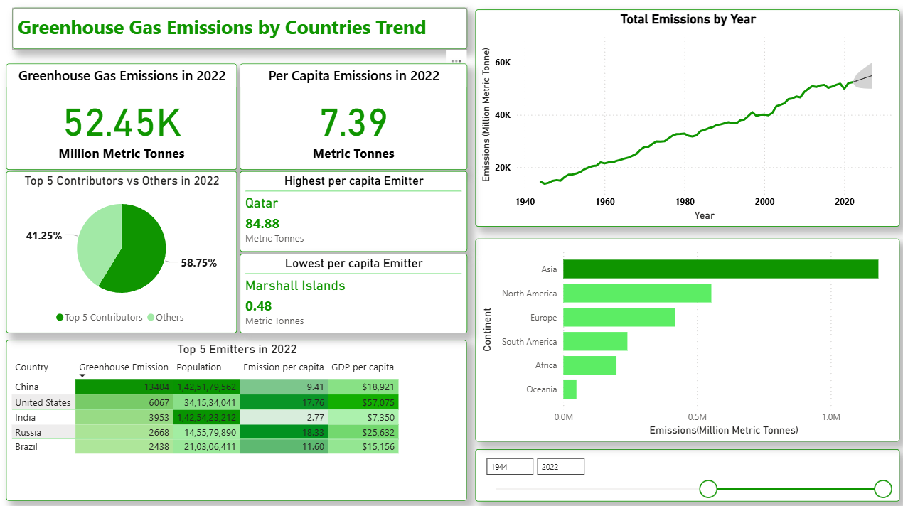

# 🌍 Greenhouse Gas Emissions Analysis Dashboard

This Power BI project explores **global greenhouse gas (GHG) emissions** and their relationship with **population, GDP, and per capita emissions** across countries and continents.  
The report provides a **comprehensive overview of emission trends (1850–2022)** and allows interactive exploration of key insights through slicers and visuals.
In addition to the report, there is the python script for webscraping countries and continent for the purpose since the raw data did not have the continent column.
---

## 📊 Dashboard Overview

### 1. **Key KPIs**
- **Total Greenhouse Gas Emissions (Million Metric Tonnes)**  
- **Per Capita Emissions (Metric Tonnes per person)**  
- **Highest Per Capita Emitter Country (dynamic by year)**  
- **Lowest Per Capita Emitter Country (dynamic by year)**  

### 2. **Visuals**
- **Line Chart**: Total emissions trend over time, with projections.  
- **Donut Chart**: Contribution of Top 5 countries vs. the rest.  
- **Table**: Top 5 emitters with population, per capita emissions, and GDP per capita.  
- **Bar Chart**: Emissions by continent.  
- **Scatter Plot**: Relationship between GDP per capita and GHG emissions, with bubble color showing per capita emissions.  

---

## 🔍 Key Insights
- Emissions have grown steadily since the 1980s, with sharp increases in Asia.  
- **Asia** dominates global emissions, led by China and India, while **North America** has the highest per capita emissions.  
- Countries like **Qatar** consistently appear as top per capita emitters, while smaller island nations often have the lowest.  
- The scatter plot shows that **higher GDP per capita generally correlates with higher emissions**, but some wealthy nations (e.g., in Europe) are starting to decouple economic growth from emissions.  

---

## 🛠️ Features Demonstrated
- Data cleaning and transformation (Power Query).  
- DAX measures for KPIs (Top N, per capita metrics, ranking, dynamic filtering).  
- Interactive storytelling with slicers and tooltips.  
- Use of advanced visuals: trend lines, conditional formatting, scatter plots.  
- Comparative analysis: **Total vs. Per Capita vs. GDP-adjusted emissions**.  

---

## 📷 Screenshots

---

## 🚀 How to Use
1. Open the `.pbix` file in **Power BI Desktop**.  
2. Use the **Year slicer** to analyze different time periods.  
3. Hover over bubbles in the scatter plot for detailed tooltips.  
4. Apply filters for **continent** or **country** to drill down further.  

---

## 📖 Learnings
This project showcases how **data visualization and storytelling** can highlight pressing environmental challenges, enabling policymakers, researchers, and the public to better understand emission drivers and patterns.

---

## 📎 Dataset
- Source: The dataset is downloaded from **Our World In Data** and has been used under Creative Commons BY License. Hannah Ritchie, Pablo Rosado, and Max Roser (2023) - “CO₂ and Greenhouse Gas Emissions” Published online at OurWorldinData.org. Retrieved from: [https://ourworldindata.org/co2-and-greenhouse-gas-emission](https://github.com/owid/co2-data)

---
